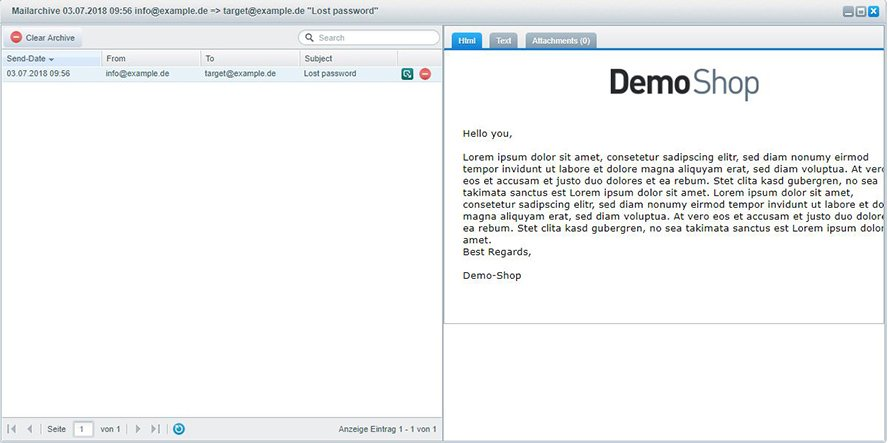

# FroshMailArchive

## Description

This plugins adds an MailArchive to your Shopware-Backend stored in Database.

Please note: FroshMailArchive won't catch your mails, to prevent sending mails from your shop! Use MailCatcher for this job, as it is a job in developing-state.

### Features

- Download Mail as EML-File
- Search Mails
- shows notification for new mails, if accepted

### Planned Features

- ...idea?

## Zip-Installation

* Download the [latest plugin version](https://github.com/FriendsOfShopware/FroshMailArchive/releases/latest/)
* Upload and install plugin using Plugin Manager

## Contributing

Feel free to fork and send [pull requests](https://github.com/FriendsOfShopware/FroshMailArchive)!

## Licence

This project uses the [MIT License](LICENCE.md).
Thanks to FroshMailCatcher for initial work :-)
